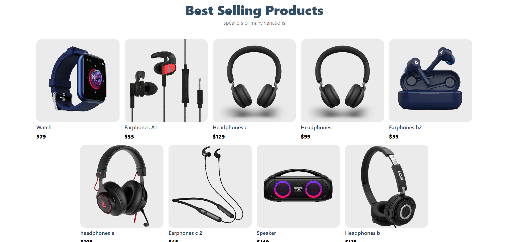
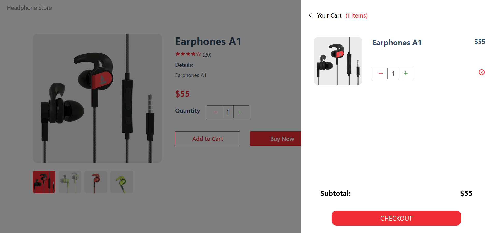

# Ecommerce App

This is a Ecommerce App.

## Features:
- Users can add their products to cart, change quantity and checkout. 

## [Deployed Link]()
## Technologies Used:
- Nextjs for the frontend
- CSS to provide styling to elements
- Sanity to act as backend to store product data

## Screenshots

### **Hero Banner**

### **Products**

### **Product Details**

### **Product Details- Recommended Products**

### **Cart**

## 🚀 About Me
I'm a BE-CS graduate from LTCE. I am interested in Web and Blockchain development. I have been coding in React for a long time and recently have picked up Nextjs and Blockchain Development.  

## 🔗 Connect With Me

